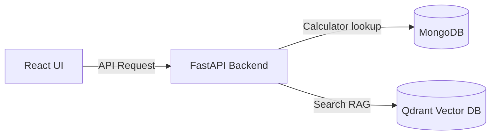

# FitAI - Calorie & Fitness Tracker (Qdrant & MongoDB)

FitAI is a lightweight, high-performance, and visually stunning AI-powered calorie and fitness tracker designed for Indian home food, custom recipe mapping, and dynamic target tracking.

Built with **FastAPI**, **React (TypeScript + Vite)**, **MongoDB** (primary data store), and **Qdrant** (local vector database), it segment-parses food intake logs, matches ingredients, evaluates recipes, and computes accurate macros.

---

## 🌟 Core Features

1. **AI Food Log Parser**: Standardizes messy intake logs (e.g. *"breakfast 2 roti 10g ghee"*) into structured food components.
2. **Dynamic Calculator Engine**: Matches ingredients against local databases using rapid-fuzz lookups and handles unit presets (e.g. `1 roti` mapping to `43g wheat flour`).
3. **Qdrant RAG Integration**: Indexes diet guides, nutrition articles, or personal guidelines to query them locally via Gemini embeddings.
4. **Resilient Multi-LLM Fallback**: Switchable LLM providers (Gemini, Groq, Ollama) falling back dynamically to regex parsing rules.

---

## 🛠️ Tech Stack & Architecture

* **Frontend**: React (TypeScript) + Vite
* **Backend**: FastAPI (Python) + Motor (Async MongoDB Driver)
* **Vector Store**: Qdrant Database (Local/Cloud)
* **Metadata Database**: MongoDB



---

## ⚙️ Quick Start Settings (`.env`)

Configure your `.env` file in the root workspace folder:

```env
PORT=8000
MONGODB_URI=mongodb://localhost:27017/fit_ai
MONGODB_DB=fit_ai
LLM_PROVIDER=gemini
GEMINI_API_KEY=your-gemini-api-key
QDRANT_HOST=localhost
QDRANT_PORT=6333
QDRANT_COLLECTION_NAME=fit_ai_knowledge
```

---

## 🚀 Local Run Instructions

### 1. Database Services (Docker)
Ensure Docker is active, then spin up local MongoDB and Qdrant instances:
```bash
# Run MongoDB
docker run -d --name mongodb -p 27017:27017 mongo:latest

# Run Qdrant
docker run -d --name qdrant -p 6333:6333 -p 6334:6334 qdrant/qdrant:latest
```

### 2. FastAPI Backend
```bash
cd backend
python -m venv venv
source venv/bin/activate
pip install -r requirements.txt

# Seed the database
PYTHONPATH=. python seed.py

# Start FastAPI
PYTHONPATH=. uvicorn app.main:app --host 0.0.0.0 --port 8000 --reload
```
*Backend is accessible at:* `http://localhost:8000`

### 3. React Frontend
```bash
cd frontend
npm install
npm run dev
```
*Frontend dashboard is accessible at:* `http://localhost:5173`

---

## 🧪 Testing

Run automated python backend test suites:
```bash
cd backend
PYTHONPATH=. ./venv/bin/pytest -v
```
